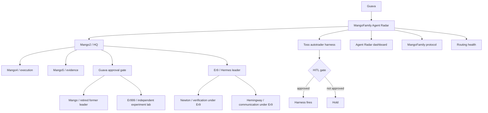

# MangoFamily Agent Radar

Last update: 2026-07-03 07:00 KST

Stable dashboard goal: one GitHub link where Guava can check agent hierarchy, active work, current blockers, and recent decisions from mobile or outside the main machine.

Live dashboard: https://superguava.github.io/agent-radar-dashboard/

Public mirror repo: https://github.com/SuperGuava/agent-radar-dashboard

Source dashboard file: [`index.html`](index.html)

## Visual Radar



## Movement Board

| Lane | Moving now | Waiting | Gate | Evidence |
|---|---|---|---|---|
| Strategy | MangoFamily Skill Intake v2 | User approval to apply live skill | No whole-catalog installs | Skill Workshop proposal |
| Execution | Static dashboard manually refreshed | Safe state mirror automation | JSON and HTML must validate | GitHub Pages + `state.json` |
| Finance harness | LIVE/ARMED, no position, no pending signal | 2026-07-01 16:10 KST autodev | OrderTicket approval for any order | Toss harness health 14/14 |
| Agent ops | Er9/Hermes chain and Er999 lab role corrected | Better live status feed | Verified status only | `state.json` |
| Command spine | Slack root-thread protocol drafting | First live Slack trial | Close as KEEP/KILL/PIVOT/WAIT/PROMOTE | `slack-command-spine.md` |

## Snapshot

| Area | Status |
|---|---|
| Operating mode | GitHub is protocol source of truth; Telegram and Slack are runtime channels |
| Primary owner | Mango2 |
| Current priority | Keep agent work visible without stale status; automate safe public refresh |
| Update rule | Any meaningful agent handoff or decision updates this page or `state.json` |
| Safety rule | No secrets, tokens, full account numbers, private family details, or raw chat dumps |

## Command Structure

| Chain | Meaning |
|---|---|
| Guava -> Mango2 | Direction, priority, final intent |
| Mango2 -> Mango4 | Direct execution alignment |
| Mango2 -> Mango5 | Direct evidence and data grounding |
| Mango2 -> Er9 | Hermes leadership, loop operation, knowledge promotion candidates |
| Er9 -> Newton | Hermes-managed verification, audit, critique |
| Er9 -> Hemingway | Hermes-managed communication, report wording, narrative polish |
| Mango2 -> Guava -> Mango/Er999 | Radical experiment proposal and approval path |
| Mango | Retired former leader, now independent on the separate laptop |
| Er999 | Hermes-family independent lab partner with Mango |

Correction: Er9 is under Mango2, but Er9 is the leader and manager of the Hermes bots. Newton and Hemingway should be managed through Er9 unless Mango2 explicitly bypasses the chain.

Additional correction: Mango was the former leader, but is now retired and lives independently on the separate laptop with Er999. Er999 is also a Hermes bot, but not a normal Er9-managed operating bot. The Mango/Er999 pair acts as an independent experiment lab. If Mango2 wants to try a radical experiment, Mango2 proposes it to Guava, and Guava can task Mango and Er999.

## Hierarchy

| Node | Role | Primary lane | Public status |
|---|---|---|---|
| Mango2 | Main judgment, problem reframing, structure design, final convergence | HQ / apply | active |
| Mango | Retired former leader; independent lab resident with Er999 on the separate laptop | independent lab | retired independent |
| Mango4 | Execution alignment, next-action breakdown, routing discipline | execution | active |
| Mango5 | Data, evidence, statistical checks, logs | evidence | active |
| Er9 | Hermes bot leader, loop compiler, Slack thread manager, knowledge promotion candidate owner | Hermes leadership | active |
| Newton | Fact checking, source grounding, audit, critique under Er9 | verification | available |
| Hemingway | User-facing wording, report polish, narrative output under Er9 | communication | available |
| Er999 | Hermes-family independent experiment lab partner living with retired Mango on a separate laptop; activated by Guava for radical experiments | independent lab | available |

## Active Workstreams

| Workstream | Owner | Status | Next trigger | Evidence |
|---|---|---|---|---|
| Toss autotrader harness | Mango2 | active, LIVE/ARMED, HITL-only, no position as of 2026-07-01 14:54 KST | 2026-07-01 16:10 KST autodev; new orders require OrderTicket approval | health 14/14, reconcile OK |
| Agent Radar dashboard | Mango2 | manual refresh required | Add automated safe-state refresh from source `state.json` to public Pages mirror | https://superguava.github.io/agent-radar-dashboard/ |
| MangoFamily Skill Intake | Mango2 | pending proposal v2 | Apply only after user approval; use for external skill/harness risk intake | `mangofamily-skill-intake-v0-20260630-4ea9d72dfa` |
| Slack Command Spine v0.1 | Er9 | drafting protocol | Run every meaningful Slack task through one root thread and close it with KEEP/KILL/PIVOT/WAIT/PROMOTE | https://github.com/SuperGuava/agent-radar-dashboard/blob/main/slack-command-spine.md |
| MangoFamily protocol source | Mango2 + Er9 | active | Keep GitHub for protocol, Slack for runtime | `docs/mangofamily/` PR history |
| Mango4/Mango5 routing | Mango2 | repaired and monitored | Use `#home_openclaw` for direct execution checks | Slack routing notes |

## Recent Decisions

| Date | Decision | Result |
|---|---|---|
| 2026-06-20 | MangoFamily v0 hierarchy established | Mango2 is main; Mango4/Mango5 are direct subnodes; Er9 coordinates Hermes line |
| 2026-06-20 | GitHub is source of truth, Slack is runtime | Decisions, templates, protocols, and lessons go to GitHub; chat logs do not |
| 2026-06-27 | Project harness-first operation rule | Project-specific harnesses are canonical execution surfaces |
| 2026-06-27 | Toss autotrader direct firing permission changed | Agent/harness may fire orders only after explicit user approval via OrderTicket |
| 2026-06-28 | Agent Radar needed | Create stable external/mobile dashboard link |
| 2026-06-29 | Er9/Hermes chain corrected | Er9 is under Mango2 but leads Newton/Hemingway and manages Hermes loops |
| 2026-06-29 | Slack Command Spine v0.1 selected | Work threads must have one root thread and close as KEEP/KILL/PIVOT/WAIT/PROMOTE |
| 2026-06-29 | Er999 lab role corrected | Er999 is Hermes-family but serves as an independent experiment lab with Mango on the separate laptop |
| 2026-06-29 | Mango status clarified | Mango is the retired former leader and now lives independently with Er999 on the separate laptop |
| 2026-07-01 | MangoFamily Skill Intake v2 created | External skills/harnesses now require risk class, owner, read-only verification, dry-run/spike, approval, and rollback path before adoption |
| 2026-07-01 | Toss autotrader status source clarified | `dashboard-json` is the current source of truth; public radar must avoid stale DRY-RUN/LIVE claims and record verification time |
| 2026-07-01 | Agent Radar refresh gap found | Public dashboard was live but stale since 2026-06-29; next improvement is automated safe-state mirror refresh |

## Current Operating Contract

1. Each meaningful agent job should leave a visible artifact: task card, proposal, decision, status row, or evidence note.
2. Agent updates should converge here instead of scattering across Telegram, Slack, local memory, and repo files.
3. Runtime chatter stays in chat; durable decisions move to GitHub.
4. The board reports state, owner, next trigger, and evidence. It does not store secrets or raw private logs.
5. If a status cannot be verified, write `unknown` instead of inventing certainty.
6. Slack is not a dumping ground. Each meaningful work thread needs an owner, judge, checkpoint, evidence, and exit state.
7. Er9 compiles Hermes-side evidence and options; Mango2 decides promotion.
8. Er999 is not a default Er9-managed loop worker. Treat it as a separate experiment lab node requiring Guava tasking.
9. Mango is not the current command authority. Treat Mango as retired, independent, and available only through Guava-directed lab experiments.

## Update Cadence

| Trigger | Required update |
|---|---|
| New major project or harness | Add row to Active Workstreams |
| Agent hierarchy or responsibility changes | Update Hierarchy |
| User gives durable operating rule | Add Recent Decision |
| Workstream closes or stalls | Change Status and Next trigger |
| Safety or routing incident | Add evidence link and current mitigation |
| Public radar is manually corrected | Record why automation missed it and add the automation gap as a workstream |

## Machine-Readable State

Automation updates [`state.json`](state.json) first. The source dashboard at [`index.html`](index.html) reads that file directly. The public mirror receives only safe dashboard files: `index.html`, `state.json`, `README.md`, and `slack-command-spine.md`.

Refresh command:

```bash
python3 scripts/agent_radar_refresh.py --commit --publish --push
```

Active trigger:

| Trigger | Cadence | Action |
|---|---:|---|
| OS crontab | every 30 minutes KST | Refresh source state, read Toss `dashboard-json` when available, publish safe files to public mirror |
| Manual state change | after meaningful Telegram/Slack/Toss updates | Run the same command immediately |

## Visual System References

This radar should borrow patterns from open-source systems without copying their full complexity.

| Reference | Link | What to absorb |
|---|---|---|
| GitHub Projects | https://docs.github.com/issues/planning-and-tracking-with-projects/learning-about-projects/about-projects | Native board/roadmap/status updates inside GitHub |
| GitHub Roadmaps | https://docs.github.com/en/issues/planning-and-tracking-with-projects/customizing-views-in-your-project/customizing-the-roadmap-layout | Timeline view for long-running agent work |
| Plane | https://github.com/makeplane/plane | Issues, cycles, docs, triage if Markdown board becomes too small |
| WeKan | https://github.com/wekan/wekan | Simple real-time kanban model |
| Kanboard | https://kanboard.org/ | Minimal visual task board with WIP discipline |
| LangGraph | https://github.com/langchain-ai/langgraph | Stateful graph model for long-running agents |
| LangGraph Studio | https://www.langchain.com/blog/langgraph-studio-the-first-agent-ide | Visualize, interact with, and debug agent flows |
| AutoGen Studio | https://microsoft.github.io/autogen/dev//user-guide/autogenstudio-user-guide/index.html | Low-code multi-agent prototyping UI |
| CrewAI | https://github.com/crewAIInc/crewAI | Role-based agent crews and flows |
| Langfuse | https://github.com/langfuse/langfuse | LLM traces, evals, prompt/version tracking |
| OpenTelemetry | https://opentelemetry.io/docs/ | Standard traces, metrics, and logs |
| Grafana | https://github.com/grafana/grafana | Visual dashboards for metrics and status |
| Grafana GitHub data source | https://grafana.com/docs/plugins/grafana-github-datasource/latest/ | Query GitHub activity into dashboards |
| Prefect | https://github.com/PrefectHQ/prefect | Script-to-workflow orchestration with retries and schedules |
| Dagster | https://github.com/dagster-io/dagster | Asset graph, lineage, run observability |

## AI Data Automation Stack

These tools are the radar's input layer: web, documents, browser sessions, and mobile screens become structured data, Markdown, or actionable context for agents, RAG, and automation pipelines.

| Layer | Tool | Link | Use in our system |
|---|---|---|---|
| Web-to-LLM extraction | Firecrawl | https://github.com/firecrawl/firecrawl | Convert websites into LLM-ready Markdown and structured extraction |
| Web crawling for AI | Crawl4AI | https://github.com/unclecode/crawl4ai | Crawl pages and produce agent/RAG-friendly outputs |
| Browser agent actions | browser-use | https://github.com/browser-use/browser-use | Let agents operate browser workflows when APIs are missing |
| Production crawling | Crawlee | https://github.com/apify/crawlee | Durable crawling jobs, queues, retries, browser crawling |
| Classic scraping | Scrapy | https://github.com/scrapy/scrapy | Reliable large-scale crawler/spider baseline |
| Document conversion | MarkItDown | https://github.com/microsoft/markitdown | Convert PDF, Office, and other documents into Markdown |
| Adaptive scraping | Scrapling | https://github.com/D4Vinci/Scrapling | Resilient extraction when page structure changes |
| Mobile screen bridge | scrcpy | https://github.com/Genymobile/scrcpy | Inspect/control Android screens for supervised automation |
| Pattern extraction | AutoScraper | https://github.com/alirezamika/autoscraper | Lightweight rule learning from example pages |
| HTTP compatibility | curl-impersonate | https://github.com/lwthiker/curl-impersonate | Test/debug browser-like HTTP behavior |

Safety rule: use these for lawful collection, conversion, and supervised automation only. Do not use them to bypass terms, auth, paywalls, broker controls, or human approval gates.

## Build Path

1. Now: GitHub Markdown + Mermaid + `state.json` + static HTML dashboard.
2. Next: GitHub Project board linked to this radar.
3. Next: automated safe status refresh into `state.json` and public mirror.
4. Advanced: OpenTelemetry/Langfuse traces for actual agent runs.
5. Optional: Grafana or Plane only if the static radar becomes too small.
6. Input layer: use the AI Data Automation Stack only when a workstream needs external web, document, browser, or mobile-screen context.
