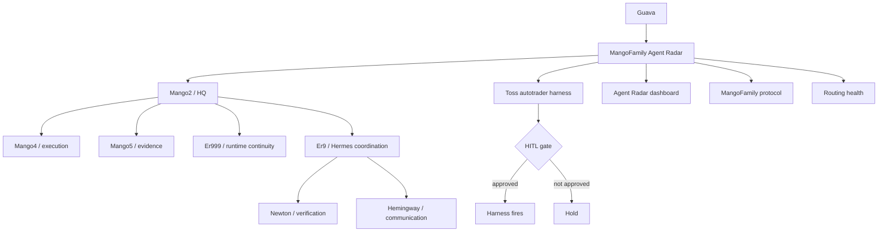

# MangoFamily Agent Radar

Last update: 2026-06-29 06:02 KST

Stable dashboard goal: one GitHub link where Guava can check agent hierarchy, active work, current blockers, and recent decisions from mobile or outside the main machine.

Live dashboard: https://superguava.github.io/agent-radar-dashboard/

Public mirror repo: https://github.com/SuperGuava/agent-radar-dashboard

Source dashboard file: [`index.html`](index.html)

## Visual Radar

## Movement Board

| Lane | Moving now | Waiting | Gate | Evidence |
|---|---|---|---|---|
| Strategy | Agent Radar v2 shape | GitHub main merge | No private raw logs | PR #4 |
| Execution | Static dashboard deployed | Safe state mirror automation | JSON and HTML must validate | GitHub Action + public Pages |
| Finance harness | Monday plan ready | Market open scan | OrderTicket approval | Toss harness |
| Agent ops | Hierarchy visible | Better live status feed | Verified status only | `state.json` |

## Snapshot

| Area | Status |
|---|---|
| Operating mode | GitHub is protocol source of truth; Telegram and Slack are runtime channels |
| Primary owner | Mango2 |
| Current priority | Make agent work visible as a single radar board |
| Update rule | Any meaningful agent handoff or decision updates this page or `state.json` |
| Safety rule | No secrets, tokens, full account numbers, private family details, or raw chat dumps |

## Hierarchy

| Node | Role | Primary lane | Public status |
|---|---|---|---|
| Mango2 | Main judgment, problem reframing, structure design, final convergence | HQ / apply | active |
| Mango4 | Execution alignment, next-action breakdown, routing discipline | execution | active |
| Mango5 | Data, evidence, statistical checks, logs | evidence | active |
| Er9 | Hermes-side coordinator and loop steward | coordination | active |
| Newton | Fact checking and source grounding | verification | available |
| Hemingway | User-facing wording and report polish | communication | available |
| Er999 | Secondary operating axis and runtime continuity | resilience | available |

## Active Workstreams

| Workstream | Owner | Status | Next trigger | Evidence |
|---|---|---|---|---|
| Toss autotrader harness | Mango2 | active, dry-run, HITL-only order firing | Monday pre-market brief, scan, then OrderTicket if candidate exists | external repo / local harness |
| Agent Radar dashboard | Mango2 | deployed via public GitHub Pages mirror | Keep private PR as protocol source, mirror safe dashboard state to public Pages repo | https://superguava.github.io/agent-radar-dashboard/ |
| MangoFamily protocol source | Mango2 + Er9 | active | Keep GitHub for protocol, Slack for runtime | `docs/mangofamily/` PR history |
| Mango4/Mango5 routing | Mango2 | repaired and monitored | Use `#home_openclaw` for direct execution checks | Slack routing notes |

## Recent Decisions

| Date | Decision | Result |
|---|---|---|
| 2026-06-20 | MangoFamily v0 hierarchy established | Mango2 is main; Mango4/Mango5 are direct subnodes; Er9 coordinates Hermes line |
| 2026-06-20 | GitHub is source of truth, Slack is runtime | Decisions, templates, protocols, and lessons go to GitHub; chat logs do not |
| 2026-06-27 | Project harness-first operation rule | Project-specific harnesses are canonical execution surfaces |
| 2026-06-27 | Toss autotrader direct firing permission changed | Agent/harness may fire orders only after explicit user approval via OrderTicket |
| 2026-06-28 | Agent Radar needed | Create stable external/mobile dashboard link |

## Current Operating Contract

1. Each meaningful agent job should leave a visible artifact: task card, proposal, decision, status row, or evidence note.
2. Agent updates should converge here instead of scattering across Telegram, Slack, local memory, and repo files.
3. Runtime chatter stays in chat; durable decisions move to GitHub.
4. The board reports state, owner, next trigger, and evidence. It does not store secrets or raw private logs.
5. If a status cannot be verified, write `unknown` instead of inventing certainty.

## Update Cadence

| Trigger | Required update |
|---|---|
| New major project or harness | Add row to Active Workstreams |
| Agent hierarchy or responsibility changes | Update Hierarchy |
| User gives durable operating rule | Add Recent Decision |
| Workstream closes or stalls | Change Status and Next trigger |
| Safety or routing incident | Add evidence link and current mitigation |

## Machine-Readable State

Automation should update [`state.json`](state.json) first. The source dashboard at [`index.html`](index.html) reads that file directly. The public mirror should receive only safe dashboard files: `index.html`, `state.json`, and `README.md`.

## Visual System References

This radar should borrow patterns from open-source systems without copying their full complexity.

| Reference | Link | What to absorb |
|---|---|---|
| GitHub Projects | https://docs.github.com/issues/planning-and-tracking-with-projects/learning-about-projects/about-projects | Native board/roadmap/status updates inside GitHub |
| GitHub Roadmaps | https://docs.github.com/en/issues/planning-and-tracking-with-projects/customizing-views-in-your-project/customizing-the-roadmap-layout | Timeline view for long-running agent work |
| Plane | https://github.com/makeplane/plane | Issues, cycles, docs, triage if Markdown board becomes too small |
| WeKan | https://github.com/wekan/wekan | Simple real-time kanban model |
| Kanboard | https://kanboard.org/ | Minimal visual task board with WIP discipline |
| LangGraph | https://github.com/langchain-ai/langgraph | Stateful graph model for long-running agents |
| LangGraph Studio | https://www.langchain.com/blog/langgraph-studio-the-first-agent-ide | Visualize, interact with, and debug agent flows |
| AutoGen Studio | https://microsoft.github.io/autogen/dev//user-guide/autogenstudio-user-guide/index.html | Low-code multi-agent prototyping UI |
| CrewAI | https://github.com/crewAIInc/crewAI | Role-based agent crews and flows |
| Langfuse | https://github.com/langfuse/langfuse | LLM traces, evals, prompt/version tracking |
| OpenTelemetry | https://opentelemetry.io/docs/ | Standard traces, metrics, and logs |
| Grafana | https://github.com/grafana/grafana | Visual dashboards for metrics and status |
| Grafana GitHub data source | https://grafana.com/docs/plugins/grafana-github-datasource/latest/ | Query GitHub activity into dashboards |
| Prefect | https://github.com/PrefectHQ/prefect | Script-to-workflow orchestration with retries and schedules |
| Dagster | https://github.com/dagster-io/dagster | Asset graph, lineage, run observability |

## AI Data Automation Stack

These tools are the radar's input layer: web, documents, browser sessions, and mobile screens become structured data, Markdown, or actionable context for agents, RAG, and automation pipelines.

| Layer | Tool | Link | Use in our system |
|---|---|---|---|
| Web-to-LLM extraction | Firecrawl | https://github.com/firecrawl/firecrawl | Convert websites into LLM-ready Markdown and structured extraction |
| Web crawling for AI | Crawl4AI | https://github.com/unclecode/crawl4ai | Crawl pages and produce agent/RAG-friendly outputs |
| Browser agent actions | browser-use | https://github.com/browser-use/browser-use | Let agents operate browser workflows when APIs are missing |
| Production crawling | Crawlee | https://github.com/apify/crawlee | Durable crawling jobs, queues, retries, browser crawling |
| Classic scraping | Scrapy | https://github.com/scrapy/scrapy | Reliable large-scale crawler/spider baseline |
| Document conversion | MarkItDown | https://github.com/microsoft/markitdown | Convert PDF, Office, and other documents into Markdown |
| Adaptive scraping | Scrapling | https://github.com/D4Vinci/Scrapling | Resilient extraction when page structure changes |
| Mobile screen bridge | scrcpy | https://github.com/Genymobile/scrcpy | Inspect/control Android screens for supervised automation |
| Pattern extraction | AutoScraper | https://github.com/alirezamika/autoscraper | Lightweight rule learning from example pages |
| HTTP compatibility | curl-impersonate | https://github.com/lwthiker/curl-impersonate | Test/debug browser-like HTTP behavior |

Safety rule: use these for lawful collection, conversion, and supervised automation only. Do not use them to bypass terms, auth, paywalls, broker controls, or human approval gates.

## Build Path

1. Now: GitHub Markdown + Mermaid + `state.json` + static HTML dashboard.
2. Next: GitHub Project board linked to this radar.
3. Later: automated status refresh into `state.json`.
4. Advanced: OpenTelemetry/Langfuse traces for actual agent runs.
5. Optional: Grafana or Plane only if the static radar becomes too small.
6. Input layer: use the AI Data Automation Stack only when a workstream needs external web, document, browser, or mobile-screen context.
